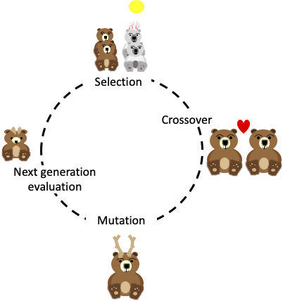
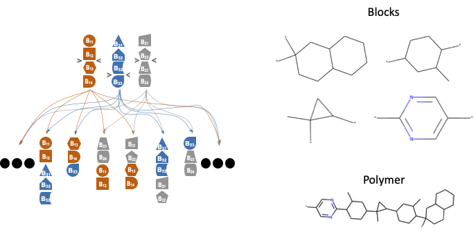

# polyga: Background
## Tutorial Navigation:
- [Home](../README.md)
- Background
- [polyga](polyga.md)

## Background 
In this background I will explain two things: how genetic algorithms (GAs) work 
and how polyga is implemented. I feel you should understand some of the basics 
behind GAs first so you understand why people use them, and then I can explain 
how polyga is implemented and why it is implemented in this way.

If you already know a lot about GAs and only care about how polyga is 
implemented, see [polyga](polyga.md).

### Genetic Algorithms
All genetic algorithms work based off the circle of life and Darwinian 
evolution.

At the top of the circle is selection. This is where certain animals (bears in
this case) are selected to breed based on environmental (or cultural) factors.
In this case, global warming (an environmental factor) is causing temperatures 
to rise, killing our poor polar bears that are maladapted to warm environments. 
Thus, only brown bears breed during the next "crossover" phase.

In this phase, animals (or polymers) breed, exchanging genetic material and
creating new children, potentially more suited to the new environment. In 
nature, this crossover is of genes, but for us it will depend on
the design task. For instance, GAs can be used to tune hyperparameters of 
machine learning models, in which case the values of those 
hyperparameters are "crossed over" or mixed. For polymers, chemically unique 
blocks are crossed over (seen in the image below). The main point is, 
this crossing over generates a new child that may have the best (or worst) 
features of both parents.

After crossover, mutation occurs. In this phase, some genes in an animal are
mutated, causing potentially beneficial adaptions to occur. In the case of our
brown bears, they now grow antlers, which admitedly might not be very useful,
but they sure are easy to make cartoons of!

Finally, each child is ranked according to some fitness function. In real life,
this fitness function is a complex function of the predators in an 
environment, terrain, disease, culture and more. Obviously this would require
a lot of computing power and code to replicate, so our GA is likely going to
be a much simpler.

This was a very basic background, if you're still curious about GAs there
is a lot more you can read, but I suggest trying to use a GA first.

### Some caveats...

#### 1. GAs tend to not generate diverse solutions
Once a basic GA finds a space that achieves the target, it tends to get stuck. 
It doesn't explore a wide space anymore, staying in the local optimum.

#### 2. GAs can generate unrealistic results
I've found that if you don't add some restrictions or way to assess realism,
they can make some wild polymers. I'm sure this is the case for other design
problems as well.

#### 3. GAs have a lot of possible selection, crossover, and mutation schemes
Selection techniques include things like  elitest selection, 
stochastic sampling, roulette wheel, tournament selection and more. Crossover
schemes include single point crossover, double point, k-point, uniform, and 
more. Mutation schemes include displacement, simple inversion, scramble 
mutation and more. My point is, polyga implements some of these and not
others, as will most GAs you find out there. These will influence results, so
I would keep in mind how any algorithm you use works if it doesn't seem to be
effective. These might influence results and you could try implementing
a different scheme if you're not satisfied.

With those caveats stated, 
[let's describe how polyga is implemented](polyga.md).
