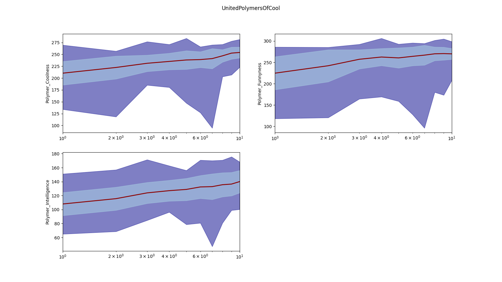
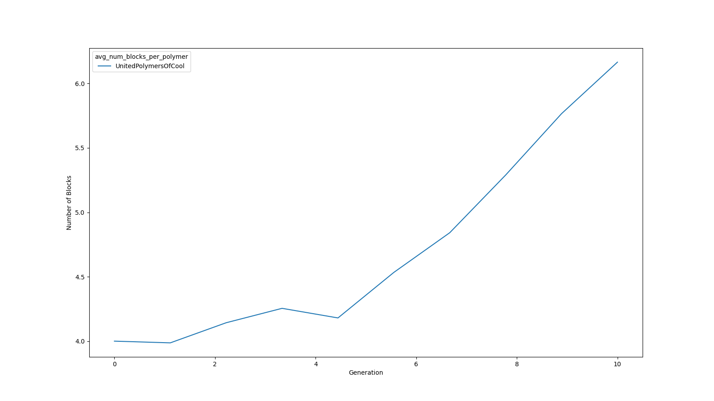

# Basic tutorials
## Navigation
- [Front Page](../../README.md)
- [Running polyga](basic.md)
- [Analyzing polyga run](analyzing.md) 
- [Prediction of properties](predict.md)
- [Fingerprinting function](fingerprinting.md)
- [Creating fitness functions](fitness.md)

## Analyzing polyga run
After running polyga, we want to analyze the polymers (or other materials)
we have created. To start, let's run the 'analyze\_silly\_test.py' script in 
the silly\_test folder by typing `python analyze_silly_test.py`
(to see how your directory should look, see the [previous tutorial](basic.md).

First, the follwing data should print to the terminal.

```
['fingerprints_1', 'fingerprints_2']  
planetary_id  
parent_1_id  
parent_2_id  
is_parent  
num_chromosomes  
smiles_string  
birth_land  
birth_nation  
birth_planet  
str_chromosome_ids  
land  
generation    
nation  
planet  
Polymer_Coolness  
Polymer_Intelligence  
Polymer_Funnyness  
```

If we open the Silly\_Test folder we should see some images as well. The first
one should look like this.  


In this image, the darkred line is the average property value per polymer at
each generation, the light blue is the average +/- the standard deviation, and
the dark blue is the min to max property value of polymers in each generation.
The generations are plotted on a log scale and we see that average values
increase per generation.

This indicates that, like in real life, each generation of polymers is getting 
progressively cooler, funnier, and smarter. However, the next image will offset
this excitement.



Here we see the polymers are getting very long. To understand why, we'll have
to examine our random forest models and fingerprints in a bit, but first, let's
go over the code that facilitated this analysis.

