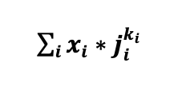

# Basic tutorials
## Navigation
- [Front Page](../../README.md)
- [Running polyga](basic.md)
- [Analyzing polyga run](analyzing.md) 
- [Prediction of properties](predict.md)
- [Fingerprinting function](fingerprinting.md)
- [Creating fitness functions](fitness.md)
- (OPTIONAL) tutorial background

## Tutorial Background
For this tutorial, I did three things:

1. Fingerprint some example polymers.

2. Create some fake properties for these polymers.

3. Create ML-models to predict these fake properties.

This is somewhat like what you would do in real life, except you would:

1. Find real, published properties for your polymers.

2. Fingerprint your polymers.

3. Create models for the published properties.

Don't make fake data :)

### Fingerprinting
First, I arbitrarily selected 2000 real repeat polymers from a list of polymers. Then,
I used rdkit to create 2048 bit morgan fingerprints with a radius of 5. If you
want to read about Morgan Fingerprints, [you can find the original paper here](https://pubs.acs.org/doi/10.1021/c160017a018).
I arbitrarily chose these values, however, as I just wanted to make sure
each polymer had a unique fingerprint. Unfortuneately, they did not, so I added
another fingerprint that was just the number of charcters in the smile string.
In real research, you'd want to make sure the fingerprint you're using actually
makes sense for your materials/properties, but, I just needed a good basic 
example. You can see the code below:
```Python
import pandas as pd
import numpy as np
from rdkit.Chem import AllChem, DataStructs
from rdkit import Chem
from collections import defaultdict

df = pd.read_csv('example_dataset.csv')
fp_dict = defaultdict(list)
for index, row in df.iterrows():
    m = Chem.MolFromSmiles(row['smiles_string'])
    # Make radius 5 so we have unique fingerprints
    fp = AllChem.GetMorganFingerprintAsBitVect(m, 5, nBits=2048)
    arr = np.zeros((0,), dtype=np.int8)
    DataStructs.ConvertToNumpyArray(fp,arr)
    fp_dict['smiles_string'].append(row['smiles_string'])
    # Add fake fingerprint to differentiate repeats
    fp_dict['fp_' + 'num_str_atoms'].append(len(row['smiles_string']))
    for i in range(len(arr)):
        fp_dict['fp_' + str(i)].append(arr[i])

df = pd.DataFrame.from_dict(fp_dict)
df.to_csv('example_dataset_fp.csv', index=False)
```

### Property creation
The next thing to do was create some fake properties. I randomly chose 
10 to 2049 properties from the fingerprint list three times: once for 
polymer coolness, once for polymer intelligence, and once for polymer
funniness. I assigned two random numbers, one an integer between 1 and 99, and
another a float between -1 and 1 for each property. The first number was
taken to the power of the second, and multiplied by the bit for a specific 
polymer. In math terms, this is shown in the img below



With i representing a specific polymer,
x<sub>i</sub> being the bit value of that fingerprint, j<sub>i</sub> being
the first number we randomly generated (1 to 99) and k<sub>i</sub> being the
second (-1 to 1). This was done for each fake property. The code is shown below:
```Python
import pandas as pd
import random

df = pd.read_csv('example_dataset_fp.csv')

cols = ['fp_' + str(i) for i in range(2048)]
cols.append('fp_num_str_atoms')
df2 = df.drop_duplicates(subset=cols)
# No repeats
print('{} -> {}'.format(len(df), len(df2)))

random.seed(10)

def prop(pol, func):
    """Function of polymer property based on input dict
    
    Args:
        pol (dict):
            polymer property dictionary
        func (dict):
            function for property
    """
    prop = 0
    for val in func:
        prop += pol[val]*func[val][0]**func[val][1]
    return prop


# Make fake properties
cool_props = random.sample(cols, random.randint(10, len(cols)))
int_props = random.sample(cols, random.randint(10, len(cols)))
fun_props = random.sample(cols, random.randint(10, len(cols)))

cool_func = {prop: [random.randint(1, 100), random.random()-random.random()] 
             for prop in cool_props} 
int_func = {prop: [random.randint(1, 100), random.random()-random.random()] 
             for prop in int_props} 
fun_func = {prop: [random.randint(1, 100), random.random()-random.random()] 
             for prop in fun_props} 

cools = []
ints = []
funs = []
for index, row in df.iterrows():
    cool = prop(row, cool_func)
    intel = prop(row, int_func)
    fun = prop(row, fun_func)
    cools.append(cool)
    ints.append(intel)
    funs.append(fun)

cool_df = pd.DataFrame.from_dict(cool_func)
int_df = pd.DataFrame.from_dict(int_func)
fun_df = pd.DataFrame.from_dict(fun_func)
cool_df.to_csv('cool_func.csv')
int_df.to_csv('int_func.csv')
fun_df.to_csv('fun_func.csv')

df['Polymer_Coolness'] = cools
df['Polymer_Intelligence'] = ints
df['Polymer_Funnyness'] = funs

df.to_csv('fp_and_properties.csv', index=False)
```

Finally, we had to make some models that will try to learn these relations.
I decided to make some simple, non-optimized random forest regression models
because it wouldn't take me too long to do. In real life, you'd want to 
choose a model to use more rigourously, optimize its hyperparameters and 
possibly do feature selection. The values for the 10% test dataset RMSE and MSE
are reported as:

MSE Polymer Coolness: 462.69287305817494  
RMSE Polymer Coolness: 21.510296907717823  
MSE Polymer Intelligence: 240.5063593005583  
RMSE Polymer Intelligence: 15.50826744999448  
MSE Polymer Funnyness: 581.2245443580997  
RMSE Polymer Funnyness: 24.108598971282003  

Again, these don't really mean much, but it's fun to practice what you 
might do in real life a little bit. This was the final step when setting up
the models for the silly tutorial, and you can see the code for this step
below:  

```Python
import pandas as pd
import numpy as np
from sklearn.model_selection import train_test_split
from sklearn.ensemble import RandomForestRegressor
from sklearn.metrics import mean_squared_error
import pickle

def make_model(X_train, X_test, y_train, y_test, y_prop):
    """Make models for properties.
    
    y_prop indicates the property. Saves regressor as name.pkl
    
    Args:
        y_prop (list):
            [0] is property, [1] is index in y data

    Returns dict of true values and predictions
    """
    name = y_prop[0]
    print(name)
    idx = y_prop[1]
    y_train = y_train[:,idx]
    y_test = y_test[:,idx]
    regressor = RandomForestRegressor(n_estimators=100)
    regressor.fit(X_train, y_train)
    y_pred = regressor.predict(X_test)
    return_dict = {name + '_True': y_test.reshape(-1), 
                       name + '_Predicted':y_pred.reshape(-1)}
    with open(name + '_random-forest.pkl', 'wb') as pickle_file:
        pickle.dump(regressor, pickle_file)
    
    mse = mean_squared_error(return_dict[name + '_True'], 
                             return_dict[name + '_Predicted'])
    with open('log.txt', 'a') as f:
        f.write('MSE_' + name + ': ' + str(mse) + '\n')
        f.write('RMSE_' + name + ': ' + str(mse**0.5) + '\n')
    return return_dict


df = pd.read_csv('fp_and_properties.csv')

fps = [col for col in df.columns if 'fp_' in col]
props = ['smiles_string', 'Polymer_Coolness', 'Polymer_Intelligence', 'Polymer_Funnyness']

X = df[fps].values
Y = df[props].values
X_train, X_test, y_train, y_test = train_test_split(X, Y, test_size = 0.1)

count = 0
save_df = pd.DataFrame()
for prop in props:
    if count != 0:
        true_pred = make_model(X_train, X_test, y_train, y_test, [prop, count])
        for col in true_pred:
            save_df[col] = true_pred[col]
    else:
        save_df['smiles_string'] = y_test[:,0]
    count += 1

save_df.to_csv('true_predictions.csv', index=False)
```
