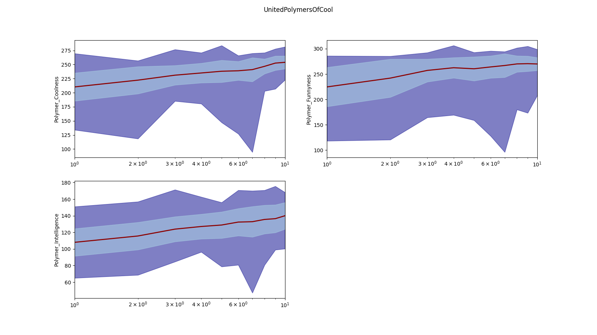

# Basic tutorials
## Navigation
- [Front Page](../../README.md)
- [Running polyga](basic.md)
- [Analyzing polyga run](analyzing.md) 
- [Prediction of properties](predict.md)
- [Fingerprinting function](fingerprinting.md)
- Creating fitness functions
- [(OPTIONAL) tutorial background](background.md)

## Creating fitness functions
Now that we have fingerprinted our polymers and predicted their properties,
we have to decide how we want them to evolve. Let's open 'silly\_utils.py'
again (see [Running polyga](basic.md) for information on the folder setup), 
and see how we evolved the polymers in this example.

Note that scikit-learn is not necessary to run polyga. We pip installed
it for this example.
```Python
import pandas as pd
import numpy as np
from sklearn.preprocessing import MinMaxScaler

def make_coolest_funniest_smartest_polymer(df, fp_headers):
    """Make the coolest fricken polymer around

    Args:
        df (pd.DataFrame):
            dataframe of population with properties predicted 

    Returns:
        Same dataframe with fitness function attached 
    """
    # Same names as returned property
    properties = [
                  'Polymer_Coolness',
                  'Polymer_Intelligence',
                  'Polymer_Funnyness'
                  ]

    fitness = []
    scaled_dict = {}
    for prop in properties:
        vals = np.array(df[prop].values)
        vals = np.reshape(vals, (len(vals), -1))
        scaler = MinMaxScaler()
        scaled_vals = scaler.fit_transform(vals)
        scaled_dict[prop] = scaled_vals

    for i in range(len(df)):
        fit = 0
        for prop in properties:
            fit += 1/3 * scaled_dict[prop][i][0]
        fitness.append(fit)

    df['fitness'] = fitness
    return df
```

Similar to when we predict properties, both the child dataframe and fingerprint
headers are passed (and must be added as variables) to the fitness function.

```Python
def make_coolest_funniest_smartest_polymer(df, fp_headers):
    """Make the coolest fricken polymer around

    Args:
        df (pd.DataFrame):
            dataframe of population with properties predicted 

    Returns:
        Same dataframe with fitness function attached 
    """
```

We'll notice the property names are the same as they are in the prediction
function. Thus, when you make the prediction function remember what you name
the properties.

The first thing I do is scale all properties so they're in the same range
(0 to 1). This is done so when I assess fitness I am assessing all properties
equally, but it is not necessary. You could choose not to scale it.
```Python
    # Same names as returned property
    properties = [
                  'Polymer_Coolness',
                  'Polymer_Intelligence',
                  'Polymer_Funnyness'
                  ]

    fitness = []
    scaled_dict = {}
    for prop in properties:
        vals = np.array(df[prop].values)
        vals = np.reshape(vals, (len(vals), -1))
        scaler = MinMaxScaler()
        scaled_vals = scaler.fit_transform(vals)
        scaled_dict[prop] = scaled_vals
```

The next thing we do is, for every polymer, sum its scaled property values and 
give them an even 1/3 weight. This is done so every fitness function is 
between 0 and 1, but, again, this isn't necessary. When we assess fitness, it
is relative to the fitness of all other polymers. Thus, you could have the
range of fitness values be between 0 and 100, -4 and 7, whatever.

```Python
    for i in range(len(df)):
        fit = 0
        for prop in properties:
            fit += 1/3 * scaled_dict[prop][i][0]
        fitness.append(fit)
```
Finally, we add the fitness function to the dataframe and return it.

```Python
    df['fitness'] = fitness
    return df
```

You can use whatever you'd like to assess the fitness of your polymers (or
other items). You can incorporate some or all of their predicted properties,
you can incorporate some or none of their fingerprints, whatever you'd like.

As we saw when we [analyzed the results of this example](analyzing.md), 
this function does cause each generation of polymers to be cooler, smarter, and
funnier than the previous!



Let's summarize what you need when making a fitness function:
1. You must have both the dataframe from polyga and the fp\_headers passed
as variables.
2. You must assess the fitness in some way and add a 'fitness' column to the 
dataframe.
3. You must return the original dataframe with the fitness column added.

Again, you can assess the fitness in anyway. Additionally, you can make
multiple fitness functions, make a land for each one, and evolve polymers
in different ways on your planet!

That's it for this basic tutorial. We learned the following things:
1. How to create a simple run of polyga.
2. How to load a run of polyga and make some basic plots.
3. How prediction of properties are performed.
4. How fingerprints can be made by you.
5. How fitness functions are made.

Next, you can either [read about how the tutorial ml models 
were made](background.md) and discover why the polymer repeat units get so big,
 or go on to our [intermediate 
tutorial](../intermediate/intro.md) where we use real models and migration
to create polymers. 
